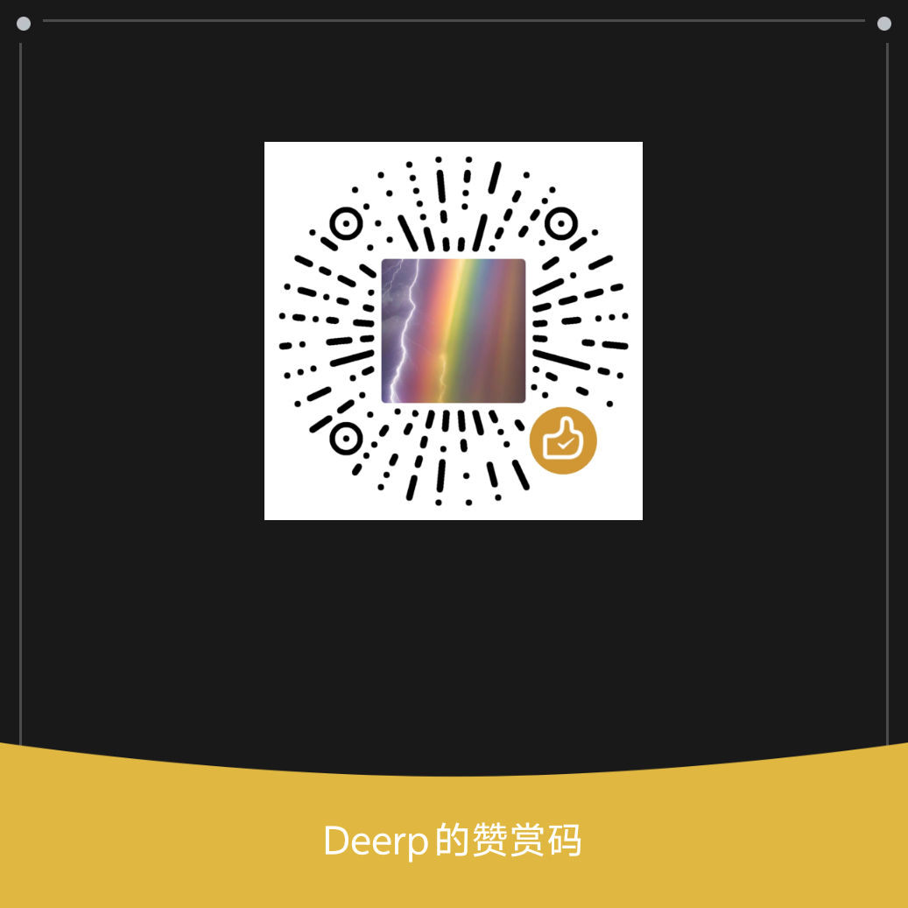

# OnlySight（唯见）

OnlySight（中文名：唯见）是一款极简 Android 自律应用。  
它基于 `AccessibilityService` + `Jetpack Compose` + OpenAI 兼容 API，对娱乐内容进行识别并打断，帮助你减少沉迷刷屏。

> 说明：当前包名与历史代码命名仍是 `com.focusai.app`（不影响使用和上架后更名）。

## 功能概览

- AI 监督：读取屏幕可见文本，交由你配置的模型判断是否娱乐
- 自动打断：判定为娱乐时自动回桌面并记录统计
- 番茄钟：专注计时（倒计时/正计时）
- 权限入口：无障碍、自启动、后台耗电管理
- 本地数据：统计与设置保存在本地（BYOK，自带 API Key）

## 快速开始（开发者）

1. 用 **Android Studio** 打开本项目
2. 等待 Gradle Sync 完成
3. 连接 Android 手机（开启 USB 调试）并点击 **Run ▶**
4. App 内按顺序配置：**配置 API** → **授权无障碍** → **开启监督**

详细步骤见：[零基础安装与原理说明.md](./零基础安装与原理说明.md)

## 默认配置

| 项 | 默认值 |
|----|--------|
| Base URL | `https://api.deepseek.com/v1` |
| Model | `deepseek-chat` |
| GitHub Issues 地址 | `app/src/main/java/com/focusai/app/data/prefs/AppSettings.kt` 中的 `GITHUB_ISSUES_URL` |

## 语言与应用名

- 中文：`唯见`
- 英文：`OnlySight`
- App 内可在「关于」页切换 `跟随系统 / 中文 / English`

## 项目结构

```
com.focusai.app/
├── MainActivity.kt
├── FocusAiApplication.kt
├── data/
│   ├── api/
│   ├── db/
│   ├── prefs/
│   └── StatsRepository.kt
├── service/FocusAccessibilityService.kt
├── ui/
│   ├── focus/
│   ├── stats/
│   ├── settings/
│   ├── about/
│   ├── navigation/
│   └── theme/
├── util/
└── viewmodel/
```
## 分享给朋友

- 方式 1：直接发 APK（`app/build/outputs/apk/debug/app-debug.apk`）
- 方式 2：发仓库地址，让朋友自己 clone + Run
- 建议在 GitHub 创建 Release，上传 APK，便于分发和版本管理

## 技术栈

- Kotlin 1.9 + Jetpack Compose
- MVVM + StateFlow + Coroutines
- Room + DataStore
- Retrofit + OkHttp
- AccessibilityService

## 安全与隐私

- App 会将屏幕文本发送到你配置的模型服务端
- 请仅使用可信 API 服务商
- 不要在仓库提交 API Key、签名文件、`local.properties`

## 支持作者 / Support the author

如果觉得唯见对你有帮助，欢迎扫码请作者喝杯咖啡 ☕  
你的支持是持续维护的动力。

<p align="center">
  
  <br/>
  <sub>Deerp 的赞赏码</sub>
</p>

## 许可证

本项目采用 [MIT License](./LICENSE)。

## 联系方式

QQ：3203581595@qq.com